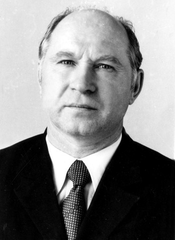

**Азовцев Григорий Романович (1925-1991)**  
  
Советский ученый биохимик, занимавшийся разработками в области биохимии лекарственных растений.  
Кандидат биологических наук, старший научный сотрудник	- Центральный сибирский ботанический сад - СО РАН  

# Содержание #
1. [Биография](##Биография)
	- [Хронология](##Хронология)  
	- [Детство](##Детство)  
	- [Начальное образование](##Начальное%20образование)  
	- [Великая отечественная война](##Великая%20отечественная%20война)  
	- [Образование](##Образование)  
	- [Научная деятельность](##Научная%20деятельность)  
	- [Кончина](##Кончина)  
2. [Семья и потомки](##Семья%20и%20потомки)  
3. [Деятельность в области биологических наук](##Деятельность%20в%20области%20биологических%20наук)  
4. [Изобретения, открытия и награды](##Изобретения, открытия и награды)  
5. [Публикации](##Публикации)
6. [Примечания](##Примечания)  
7. [Литература](##Литература)  
8. [Ссылки](##Ссылки)  

# Биография #   
## Хронология ##
**1925** - Родился Алтайский край, Благовещенский р-н, п. Восточный.  
**1943-44** - Воевал с 1943-го по 1944-й год. Сержант. Второй Украинский, Второй Прибалтийский фронты. Награды: медаль "За победу над Германией.  
**1991** - скончался в результате сердечного приступа.

## Детство ##
Родился 1925 года п. Восточный, Благовещенский р-н, Алтайский край, Россия

## Начальное образование ##
Начальное образование получил в школе д.Ордынск

## Великая отечественная война ##
Воевал с 1943-го по 1944-й год.  
Сержант.  
Второй Украинский, Второй Прибалтийский фронты.  
Награды: медаль "За победу над Германией".  
Архив: Фотоархив СО РАН, Источник: Фотовыставка к 60-летию Победы  

## Образование ##
После войны закончил Новосибирский Аграрный университет 
Аспирантура

## Научная деятельность ##
участник в орг.:  
старший научный сотрудник	
Центральный сибирский ботанический сад - СО РАН	  
[Лаборатория биохимии](http://www.csbg.nsc.ru/ru/struktura/nauchnye-podrazdeleniya/laboratoriya-fitohimii/istoriya-13.html)  

Защитил диссертацию на соискание ученой степени кандидата биологических наук:  
Автореферат диссертации [link 1](https://rusist.info/book/7452900) [link 2](https://prochtenie.org/fullcatalog/2234)   
Изучение фенольных веществ Западно-Сибирских представителей рода Sanguisorba L. : Автореф. дис. на соиск. учен. степени канд. биол. наук (1973) (03.00.04)   
Язык:Русский Страниц:29  
Описание: Азовцев Г.Р. Изучение фенольных веществ Западно-Сибирских представителей рода Sanguisorba L. : Автореф. дис. на соиск. учен. степени канд. биол. наук / Новосиб. гос. мед. ин-т.   
- Новосибирск, 1973.  
- [1], 29 с. : ил. ; 21 см.  
- Список работ авт.: с. 28  
Примечания: Для служебного пользования. Экз. № 00014 . - Список работ авт.: с. 28  
Для служебного пользования  RuMoRGB  
Шифр хранения: DSP ДСП/Др 7535   Места хранения	DSP ДСП/Др 7535  

## Кончина ##
Скончался в результате инфаркта миокарда в сентябре 1991.

# Семья и потомки #
Жена - Азовцева Зоя Ионовна  
Двое детей (Татьяна и Галина)  

# Деятельность в области биологических наук #
участник в орг.:  
старший научный сотрудник	
Центральный сибирский ботанический сад - СО РАН	
[Лаборатория биохимии](http://www.csbg.nsc.ru/ru/struktura/nauchnye-podrazdeleniya/laboratoriya-fitohimii/istoriya-13.html)  

История  
Лаборатория фитохимии была основана в 1955 г. в структуре Медико-биологического института Западно-Сибирского филиала АН СССР под названием "Лаборатория биохимии". 
Позднее, в 1960 г., она была переведена в Центральный сибирский ботанический сад СО АН СССР. 
Основателями лаборатории являются к.б.н. Федорова В. С. и д.б.н. Минаева В.Г., которые работали с первых дней ее создания и заложили научные направления ее деятельности.
К 1970 г. лаборатория представляла собой сильный научный коллектив, 
так как молодые аспиранты и соискатели Демина Т.Г., Азовцев Г.Р., Волхонская Т.А., Высочина Г.И., Валуцкая А.Г., Киселева А.В., Полякова Л.В., Пеккер Е.Г., Кадырова Р.Б. успешно защитили кандидатские диссертации по двум основным направлениям – в области "белковой биохимии" и биохимии веществ вторичного синтеза. 
С 1968 г. по 1991 г. лабораторию возглавлял к.б.н. Киселев В.Е.

[Высочина Г.И.](http://www.csbg.nsc.ru/ru/struktura/nauchnye-podrazdeleniya/laboratoriya-fitohimii/sotrudniki-12/vysochina-galina-ivanovna.html)  
[Кукушкина Т.А.](http://www.csbg.nsc.ru/ru/struktura/nauchnye-podrazdeleniya/laboratoriya-fitohimii/sotrudniki-12/kukushkina-tatyana-abdulhailovna.html)  
[Кукушкина Т.А.](https://csbg-nsk.ru/kukushkina_ta)  

# Изобретения, открытия и награды #  

Из известных военных наград (уточняется)  
Чем награждён:  
Медаль "За победу над Германией"
Орден Отечественной войны I степени  
Дата представления к награде: 01.08.1986  
Инициатор: Министр обороны СССР  
Реквизиты документа: ЦАМО. Юбилейная картотека награждений, шкаф 1, ящик 16. Номер документа 54.  

## Патенты, изобретения ##
Изобретатель АЗОВЦЕВ ГРИГОРИЙ РОМАНОВИЧ является автором\соавтором следующих патентов:  

[ПАТЕНТ **858833**](http://www.prometeus.nsc.ru/patent/1997/24.ssi)  
Средство,обладающее способностью повышать работоспособность организма, а также антигипоксическим и стимулирующим действием на сердце  
Авторы изобретения Г.P.Азовцев, Е.Г.Изюмов и А.А.Зыков   
Центральный сибирский ботанический сад СО РАН отделения АН СССР и Новосибирский государственный медицинский институт (71)   
Изобретение относится к фармакологии и кас...  

[ПАТЕНТ **2094049**](http://www.prometeus.nsc.ru/patent/1997/24.ssi)  
Изобретения Сибирского отделения РАН  
Реферативный указатель патентов за 1997 год  
(11) 2094049     
(46) 27.10.97  
(51) 6 А 61 К 35/78  
(21)5047875/14  
(22) 16.03.92  
(71) Институт клинической и экспериментальной лимфологии СО РАМН, Центральный сибирский ботанический сад СО РАН, Научно-производственное объединение "ИМСИБ"  
(72) Азовцев Г. Р., Бородин Ю. И., Грек О. Р., Григорьев В. Н., Колесникова О. П., Кукушкина Т. А, Ширинский В. С., Зыков А. А, Жук Е. А  
(73) Институт клинической и экспериментальной лимфологии СО РАМН, Центральный сибирский ботанический сад СО РАМН, Научно-производственное объединение "ИМСИБ"  
(54) СРЕДСТВО, УЛУЧШАЮЩЕЕ ГЕМО - И ЛИМФОЦИРКУЛЯЦИЮ И УСИЛИВАЮЩЕЕ РЕГЕНЕРАТОРНЫЕ ПРОЦЕССЫ В ЛИМФАТИЧЕСКИХ УЗЛАХ ПРИ АРТЕРИАЛЬНОЙ ИШЕМИИ  
(57) Использование: средство, улучшающее гемо- и лимфоциркуляцию, усиливающее регенераторные процессы в лимфатических узлах при артериальной ишемии относится к области медицины, а именно к лекарственным препаратам, применяемым при заболеваниях, связанных с нарушением крово- и лимфообращения с признаками иммунной недос-гаточности. Сущность изобретения: изобретение дает возможность достигать более эффективного восстановления объемного кровотока при артериальной ишемии, осуществляет стимуляцию иммунной системы и регенерацию лимфатических узлов, выполняющих важную роль в гемолимфоциркуляторных процессах путем использования средства, стимулирующего восстановление гемо- и лимфоциркуляции, состоящее из комплекса биологически активных полифенолов подземных органов шиповника, экстрагированных этилацетатом, осажденных в хлороформе и высушенных в вакууме. 8 табл.  

Азовцев Г.Р., Бородин Ю.И., Григорьев В.Н., Колесникова О., Зыков А.А., Кукушкина Т.А., Жук Е.А.  
Средство, улучшающее гемо- и лимфоциркуляцию и усиливающее регенераторные процессы в лимфатических узлах при артериальной ишемии. 
Патент № 2094049. Москва. 1997.
 
NUMBER: **RU2094049C1**  
TITLE: AGENT IMPROVING HEMO- AND LYMPHOCIRCULATION AND ENHANCING REGENERATIVE PROCESSES IN LYMPH NODES AT ARTERIAL ISCHEMIA		  
YEAR: 1992  
AUTHOR: Azovtsev G.R., Borodin Ju.I., Grek O.R., Grigor'Ev V.N., Kolesnikova O.P., Kukushkina T.A., Shirinskij V.S., Zykov A.A., Zhuk E.A.  

## Открытия ##  
[**Sanguisorba azovtsevii**](https://www.gbif.org/species/3029579)  
Русскоязычные названия  
Научные: **Кровохлёбка Азовцева**  
Систематика  
отдел	**Magnoliophyta**  
класс	**Magnoliopsida**  
порядок	**Rosales**  
семейство	**Rosaceae**  
род	**Sanguisorba**  
вид	**azovtsevii Pshenich. & Krasnob.**

[**Sanguisorba azovtsevii Krasnob. et Pschen.**](http://www.efloras.org/florataxon.aspx?flora_id=120&taxon_id=242442753)  
Stem 80-100 (-120) cm, rhizome short, roots numerous. Leaves pinnate, glabrous.   
Basal leaves long-petiolate, 30-40 cm x 10-12 cm, stem leaves shorter, sessile. Leaflets lanceolate-oblong, slightly heart-based, serrate-dentate. 
Flowers very small red-purple, stigma fringed, black stamens exserted.  
Inflorescence cylindrical, 4-7 cm long, 1-1.5 cm wide, erect, sometimes pendent.  
Siberia: Altay. On grassy slopes, in meadows, in forest clearings.  

## Публикации ##

### 1965 ###
Джемухадзе К. Μ., Азовцев Г. Р. 1965. Катехины кровохлёбки (Sanguisorba L.) И Докл. АН СССР. Т. 161, № 3. С. 715-717.  
К. М. Джемухадзе, Г. Р. Азовцев. Докл. АН СССР, 1965, 161, 715.  
K. M. Dzhemukhadze and G. R. Azovtsev, Dokl. Akad. Nauk SSSR, 161(3), 715–717 (1965).  
> https://www.jstage.jst.go.jp/article/cpb1958/33/4/33_4_1503/_article  
> https://www.researchgate.net/publication/9292334_The_catechins_of_Sanguisorba  
> https://dankonoy.com/ege22/2022/02/19/rod-27-sibiraea-maxim-sibirka/  
> https://e-varamu.ee/item/VSG77DTYXG4NU4C6FL7O55YT2UTBLUBJ?lang=de  

Pealkiri	Фенольные соединения и их биологические функции : материалы 1-го Всесоюзного симпозиума по фенольным соединениям, состоявшегося 14-17 декабря 1966 г. в Москве / Академия наук СССР, Институт физиологии растений им. К. А. Тимирязева, Институт биохимии им. А. Н. Баха  
Ilmunud	Москва : Наука, 1968  
Kirjeldus	421, [1] lk. : ill, ; 22 cm  
Püsilink	https://www.ester.ee/record=b1857730*est  

### 1966 ###
[Г. Р. Азовцев. Растительные ресурсы, 1966, 2, 70.  ](https://link.springer.com/article/10.1023/A:1026319524715)     
[G. R. Azovtsev. Variability in concentration of tannic acid in Sanguisorba officinalis L., Rast. Res., 2(1), 70–76 (1966).](https://bibliotekanauki.pl/articles/71136.xml)  

### 1967 ###
Г. Р. Азовцев. Шв. СО АН СССР, серия биол.-мед. наук, № 1, 1967.  

### 1968 ###
Фенoльные сoединения и их биoлoгические функции : материалы 1 Всесоюзного симпозиума по фенольным соединениям, состоявшегося 14-17 декабря 1966 г. в Москве / АН СССР, Ин-т физиологии растений им. К. А. Тимирязева [и др.] ; отв. ред. Курсанов А. Л. и Запрометов М. Н. - Москва : Наука, 1968. - 421 с. : ил. - Библиогр. в конце докл.  
сборник   

Фенольные соединения и их биологические функции : материалы 1-го Всесоюз. симпозиума по фенольным соединениям, состоявшегося 14-17 дек. 1966 г. в Москве / отв. ред. акад. А.Л. Курсанов и д-р биол. наук М.Н. Запрометов  
Курсанов А.Л. , Запрометов М.Н.; Год издания  1968; Место издания  М. : Наука  
https://rusneb.ru/catalog/002676_000027_IRKNB-RU_%D0%98%D0%9E%D0%93%D0%A3%D0%9D%D0%91_HOBBIT_577.4_%D0%A4+42-000000-340893/  

https://csbg-nsk.ru/kukushkina_ta#!/tab/358084232-2  
https://www.dissercat.com/content/farmakognosticheskoe-izuchenie-krovokhlebki-lekarstvennoi-sanguisorba-officinalis-l-i-perspe  

Азовцев Г. P., Джемухадзе К. Μ. 1968. Фенольные соединения кровохлёбки // Фенольные соединения и их биологические функции. Μ. С. 212-217.  
G. R. Azovtsev and K. M. Dzhemukhadze, Phenolic Compounds and Their Biological Functions [in Russian], Meditsina, Moscow (1968), pp. 212–217.  

### 1969 ###
Азовцев Г. Р. 1969. Биохимическое исследование представителей рода Sanguisorba L. на лейкоантоциановые соединения И Изв. Сиб. отд-ния АН СССР. Сер. биол. науки. № 15, вып. 3. С. 68-72.  

### 1971 ###
Фенoльные сoединения и их физиoлoгические свoйства [текст] : материалы 2 Всесоюзного симпозиума по фенольным соединениям, состоявшегося 17-21 мая 1971 г. в Алма-Ате / редкол.: Клышев Л. К. (отв. ред.) [и др.] ; АН КазССР, Науч. совет по физиологиии и биохимиии растений, Ин-т ботаники [и др.]. - Алма-Ата : Наука, 1973. - 238 с. : ил. - Библиогр. в конце докл.  

Киселёв В. Е. и др. 1971. Флавоноиды некоторых растений сибирской флоры / В. Е. Киселёв, Т. Д. Дёмина, Г. P Азовцев, Л. В. Полякова, Г. В. Высочина H Растительные богатства Си­бири. Новосибирск. С. 93-103.  

https://agris.fao.org/agris-search/search.do?recordID=US201302280965  
Polyploid forms among Siberian species of burnet and their characteristics  [1971]  
Azovtsev, G.R.; Zaitseva, E.A.;  
Bibliographic information  
Language:Russian  
Type:Journal Article  
In AGRIS since:2013  
Start Page:140  
End Page:144  
All titles:"Polyploid forms among Siberian species of burnet and their characteristics"@eng  
Other:"Title in original language could not be transcribed. In Russian; Includes summary in English"  

### 1984 ###
Азовцев Г.Р., Зыков А.А., Кукушкина Т.А. Биологически активный комплекс кровохлебки и его фармакологические свойства // 1-ая Респ.конф. по медицинской ботанике. Киев. 1984. C. 128.  
Азовцев Г.Р., Зыков А.А., Кукушкина Т.А. О действующих веществах кровохлебки лекарственной // «Лекарственные растения в традиционной и народной медицине». Научн.конф. Улан-Уде. 1984. С.45-46.  

### 1985 ###
 https://www.ncbi.nlm.nih.gov/pmc/articles/PMC7824365/  
 Krasnoborov I.M., Azovtsev G.R., Orlov V.P. A new species of the genus Hedysarum L. (Fabaceae L.) from southern Siberia. Bot. Zh. 1985;70:968–973. [Google Scholar]  

288 книжка 
 [1] Krasnoborov, I.M., Azovtsev, G.R., & Orlov, V.P. (1985). Novyy vid roda Hedysarum (Fabaceae) iz Yuzhnoy Sibiri [New Species of Hedysarum Genus (Fabaceae) from Southern Siberia]. Botanicheskiy zhurnal, 70(7), 968-973.  

 ссылка https://zaguan.unizar.es/record/70587/files/texto_completo.pdf?version=1  
 файл texto_completo.pdf1.pdf  
 Krasnoborov I.M., Azovtsev G.R. and Orlov V.P., A new species of the genus Hedysarum (Fabaceae) from the southern Siberia, Bot. Zhurn. (Moskow Leningrad) 70, 1985, 968–973, (In Russian).  
 
### 1986 ###
Головнёв В. А. и др. 1986. Влияние полифенолов манжетки (Alchemilla vulgaris) на микроциркуляторное русло при метаболических нарушениях миокарда / В. А. Головнёв, А. А. Зы­ков, 3. Т. Бикбулатов, Г. Р. Азовцев // Новые лекарственные препараты из растений Сиби­ри и Дальнего Востока. Томск. С. 40-41.  
Зыков А. А. и др. 1986. Экспериментальная терапия гиперлипидемии биофлавоноидами / А. А. Зыков, О. Р. Грек, А. В. Долгов, А. А. Семёнов, А. А. Азовцев // Новые лекарствен­ные препараты из растений Сибири и Дальнего Востока. Томск. С. 65-66.   

### 1987 ###
Азовцев Г.Р., Зыков А.А., Кукушкина Т.А. Полифенольный комплекс кровохлебки лекарственной как антигипоксическое средство // 5-ый Всесоюзный симпозиум по фенольным соединениям. Таллин. 1987. Т.3. С. 3-4.  
Азовцев Г. P., Кукушкина Т. А., Зыков А. А. 1987. О действующих веществах кровохлёбки лекарственной // Лекарственные растения в традиционной и народной медицине. Улан-Удэ, 1987. С. 5-6.  
Зыков А. А. и др. 1987. Влияние манжетки обыкновенной на жирнокислотный спектр сыворотки крови и лимфы у кроликов с экспериментальным инфарктом миокарда / А. А. Зыков, О. Р. Грек, Г. Р. Азовцев, 3. Т. Бикбулатов, В. А. Головнёв // Лекарственные растения в тради­ционной и народной медицине. Улан-Удэ. С. 70-71.  

### 1988 ###
Азовцев Г.Р., Зыков А.А., Кукушкина Т.А. Полифенольный комплекс кровохлебки аптечной как капилляропротекторное средство // 2-ая Республ. конф. по медицинской ботанике. Киев. 1988. С.331-332.  

### 1989 ###
Шарапов В. И. и др. 1989. Влияние биофлавоноидов на активность микросомальной моноок­сигеназной системы печени / В. И. Шарапов, А. А. Зыков, О. Р. Грек, Г. Р. Азовцев // Но­вые лекарственные препараты из растений Сибири и Дальнего Востока. Томск. С. 191-192.  

### 1990 ###
Головнев В.А., Кузнецов А.В., Зыков А.А., Азовцев Г.Р., Кукушкина Т.А. Морфофункциональное изучение микроциркуляции при экспериментальном инфаркте миокарда и его коррекция биофлавоноидами // «Поиск новых лекарственных средств и их испытание в клинике». Всерос. научн. конф. Чита. 1990. С.146-148.  
Головнев В.А, Кузнецов А.В., Азовцев Г.Р., Кукушкина Т.А. Влияние биофлавоноидов в сочетании с радоновыми ваннами на микрофункциональные изменения регионарных лимфатических узлов сердца при экспериментальном инфаркте миокарда // «Курортные факторы в лечении и реабилитации больных сердечно-сосудистыми и эндокринными заболеваниями». Рег. научн. конф. Белокуриха. 1990. С.4-5.  
Зыков А.А., Головнев В.А., Азовцев Г.Р., Кукушкина Т.А. Влияние биофлавоноидов на свертывающую систему крови у животных с экспериментальным инфарктом миокарда // Изд-во ИЛИМ. Фрунзе.1990. С.128.

### 1997 ###
[патент](https://elibrary.ru/item.asp?id=38082680)  
Азовцев Г.Р., Бородин Ю.И., Григорьев В.Н., Колесникова О., Зыков А.А., Кукушкина Т.А., Жук Е.А. Средство, улучшающее гемо- и лимфоциркуляцию и усиливающее регенераторные процессы в лимфатических узлах при артериальной ишемии. Патент № 2094049. Москва. 1997.  

## Ссылки  ##
[Azovtsev G.R.](https://agris.fao.org/agris-search/search.do?recordID=US201302280965)  
 
Bibliography of Agriculture, Volume 39, Issues 1-6  
 https://books.google.ca/books?id=yWmW-aQ3T3UC&pg=RA1-PA154&lpg=RA1-PA154&dq=Azovtsev+G.R.&source=bl&ots=6Ts6hfPWnB&sig=ACfU3U3bjKye2iBfc7FuPGl0XiQGGjeBPQ&hl=en&sa=X&ved=2ahUKEwipy6iCguH4AhVDLn0KHdHhDB8Q6AF6BAgZEAM#v=onepage&q=Azovtsev%20G.R.&f=false
 каритнка с номером 125216  
 The Library, 1975 - Agriculture  

https://books.google.ca/books?id=IPbsCgAAQBAJ&pg=PA57&lpg=PA57&dq=Azovtsev+G.R.&source=bl&ots=40_mv0RuS7&sig=ACfU3U1cnxv-ykrGlJHq-N6yu8ZbqaEuwQ&hl=en&sa=X&ved=2ahUKEwipy6iCguH4AhVDLn0KHdHhDB8Q6AF6BAgbEAM#v=onepage&q=Azovtsev%20G.R.&f=false
International Collation Of Traditional And Folk Medicine, Vol 1, Northeast ...  
edited by Takeatsu Kimura, Paul Pui-hay But, Ji-xian Guo, Ki Sung Chung   

International Collation Of Traditional and Folk Medicine.png  

International Collation Of Traditional And Folk Medicine, Vol 1, Northeast Asia: Part 1  
Takeatsu Kimura, Paul Pui-hay But, Ji-xian Guo, Ki Sung Chung  
World Scientific, Apr 19, 1996 - Medical - 238 pages  

Traditional folk medicine practices in Korea, China, Japan, and Hong Kong — all located in Northeast Asia — are comparable. Since different usage of a medicine may reflect cultural or regional differences, a detailed collation of the folk knowledge of traditional medicine can help to distinguish between true medical knowledge and superstition.In this first volume of a series of books that will compare the differences and similarities of traditional folk medicine practiced around the world, 200 of the most frequently used medicinal plants in Northeast Asia are selected by the international editorial board to be featured.The folk medical knowledge in each entry includes the botanical and local names of the drug, special processing, the administration method, efficacy in each country, contra-indications, and side effects. Also included are the scientific data on their chemistry and pharmacology, with references.All this scientific information should be a valuable asset to medical and research scientists working on the bioactive components of natural products.  

https://books.google.ca/books?id=VpxGDwAAQBAJ&pg=PT106&lpg=PT106&dq=Azovtsev+G.R.&source=bl&ots=fMFBJacxvd&sig=ACfU3U3_YiNflqNmijqfkJOTWohhtHqbLw&hl=en&sa=X&ved=2ahUKEwipy6iCguH4AhVDLn0KHdHhDB8Q6AF6BAgaEAM#v=onepage&q=Azovtsev%20G.R.&f=false  
Anthocyanins in Fruits, Vegetables, and Grains  
By Giuseppe Mazza  

Anthocyanins in Fruits, Vegetables, and Grains  
Front Cover  
Giuseppe Mazza  
CRC Press, Jan 10, 2018 - Science - 384 pages  
0 Reviews  
This text is a comprehensive reference covering the chemistry, physiology, chemotaxonomy, biotechnology and food technology aspects of the anthocyanins. Topics discussed include types of anthocyanins, structural transformations, colour stabilization and intensification factors, biosynthesis and intensification factors, biosynthesis, analysis and functions of anthocyanins. An in-depth review of the literature discussing anthocyanins of fruits, cereals, legumes, roots, tubers, bulbs, cole crops, oilseeds, herbs, spices, and minor crops is included as well  

 
 https://assets.researchsquare.com/files/rs-1387892/v1/1fa3a632-7787-4ac5-be5a-22659310650c.pdf?c=1648449548
 1fa3a632-7787-4ac5-be5a-22659310650c.pdf?c=1648449548.pdf
 15. Krasnoborov I.M., Azovtsev G.R., Orlov V.P. (1985). A new species of the genus Hedysarum
(Fabaceae) from Southern Siberia Bot. magazine, 70(7): 968-973.

 

Вопросам изучения фармакологической активности корневищ и корней кровохлебки лекарственной посвящены исследования отечественных и зарубежных ученых,
подтверждающие наличие противовоспалительной, вяжущей, кровоостанавливающей, выраженной антибактериальной активности, установлено антигипоксическое действие, но недостаточно изучены
фармакологические свойства травы кровохлебки (Азовцев Г.Р. и др., 1987; Пастушенков Л.В. и др., 2012; Чиков П. С., 1983; Kokoska E.R. и др., 2001). 
Зарубежными учеными для корневищ и корней кровохлебки лекарственной установлена противовирусная, высокая антиоксидантная и иммуномодулирующая активности, 
а также антипролиферативная активность в отношении ряда раковых клеток. 
Имеются данные, что экстракт корневищ и корней кровохлебки лекарственной защищает кожные покровы от ультрафиолетового облучения 
(Hachiya A. et al., 2001; Huang H.B. et al., 2008; Kim T.G. et al., 2001; Tsukahara K. et al., 2001).
http://www.dslib.net/farmakognozia/farmakognosticheskoe-izuchenie-krovohlebki-lekarstvennoj-i-perspektivy-ee.html

eLIBRARY ID: 45796084	EDN: PFPPKG		DOI: 10.31518/2618-9100-2021-2-9
"ИМЕНА СОБСТВЕННЫЕ ОТДЕЛЬНЫХ СИБИРСКИХ РАСТЕНИЙ": ВЫСТАВКА БОТАНИЧЕСКОГО МУЗЕЯ СИБИРИ

КОРОЛЮК ЕЛЕНА АНАТОЛЬЕВНА1, ДОРОНЬКИН ВЛАДИМИР МИХАЙЛОВИЧ1
1 Центральный сибирский ботанический сад Сибирского отделения Российской академии наук, Новосибирск, Россия
Тип: статья в журнале - научная статья Язык: русский
Номер: 2 (16) Год: 2021 Страницы: 112-117 Поступила в редакцию: 25.02.2021
     УДК: 069.5:58.007 + 58.006 (571.1/.5)
ЖУРНАЛ: 	
ИСТОРИЧЕСКИЙ КУРЬЕР
Учредители: Институт истории СО РАН
eISSN: 2618-9100
КЛЮЧЕВЫЕ СЛОВА:
 	
СИБИРЬ, БОТАНИЧЕСКИЙ МУЗЕЙ СИБИРИ, ЦСБС СО РАН, ПАТРОНИРОВАННЫЕ ТАКСОНЫ ЦВЕТКОВЫХ РАСТЕНИЙ, ЛИШАЙНИКОВ, ВОДОРОСЛЕЙ, ИСТОРИЯ БОТАНИЧЕСКИХ ИССЛЕДОВАНИЙ
АННОТАЦИЯ: 	
В Ботаническом музее Сибири (ЦСБС СО РАН, г. Новосибирск) в связи с 75-летним юбилеем сада была организована временная экспозиция 
«Имена собственные некоторых сибирских растений (патронированные таксоны)». 
Патронация была произведена в честь 19 ботаников Центрального сибирского ботанического сада СО РАН - это 1 род, 37 видов и 2 подвида цветковых растений, 
по 1 роду и 2 видам среди лишайников и водорослей. 
В статье обобщаются данные о собственно таксонах, о личностях, в честь которых были предложены имена собственные. 
Кратко описан вклад ботаников в науку, приведены биографические данные, исторические факты, раскрывающие мотивацию присвоения новым таксонам (видам, родам, гибридам) 
имен сотрудников ботанического сада. 
Отмечается, что практика наименования связана с активизацией работ по исследованию растительности Сибири, ее флористического состава и обобщению этих материалов 
в крупных флористических трудах, которые вышли в XX столетии при непосредственном участии ботаников Центрального сибирского ботанического сада СО РАН.

БИБЛИОМЕТРИЧЕСКИЕ ПОКАЗАТЕЛИ:
  Входит в РИНЦ®: да	  Цитирований в РИНЦ®: 0
  Входит в ядро РИНЦ®: нет	  Цитирований из ядра РИНЦ®: 0
  Норм. цитируемость по журналу: 	  Импакт-фактор журнала в РИНЦ: 0,265
  Норм. цитируемость по направлению: 	  Дециль в рейтинге по направлению: 
  Тематическое направление: Biological sciences
  Рубрика ГРНТИ: 	Биология / Ботаника
  
  
ОПИСАНИЕ НА АНГЛИЙСКОМ ЯЗЫКЕ: 	
“THE PROPER NAMES OF SOME SIBERIAN PLANTS”: THE EXHIBIT OF THE BOTANICAL MUSEUM OF SIBERIA
KOROLYUK ELENA ANATOL'EVNA1, DORONKIN VLADIMIR MIKHAILOVICH1
1 Central Siberian Botanical Garden of the Siberian Branch of the Russian Academy of Sciences, Novosibirsk, Russia
 	
The article is devoted to the temporary exhibit “Proper names of some Siberian plants” marking the 75th anniversary 
of the Central Siberian Botanical Garden of the Siberian Branch of the Russian Academy of Sciences (CSBG SB RAS, Novosibirsk). 
The names of 19 botanists from CSBG were memorized in 43 plants represented by angiosperms (1 genus, 37 species and 2 subspecies), 
lichens and algae (1 genus and 2 species each). 
The article contains information about the taxa and the personalities whose names were offered for the plants’ proper names. 
Their biography and contribution to botanical science are described in brief, as well as the historical facts that motivated 
their colleagues to give the proper names to the new taxa (species, genera and hybrids). 
It is worth mentioning that such naming was invigorated by the increased rates of investigations of Siberian vegetation and 
its floristic composition, and by subsequent generalization of these data into the large floristic works printed in the 20th century 
with personal contribution of the botanists of the Central Siberian Botanical Garden, SB RAS.
 	
Keywords: SIBERIA, BOTANICAL MUSEUM OF SIBERIA, CSBG SB RAS, PROPER NAMES OF ANGIOSPERMS, LICHENS AND ALGAE TAXA, THE HISTORY OF BOTANICAL INVESTIGATIONS
